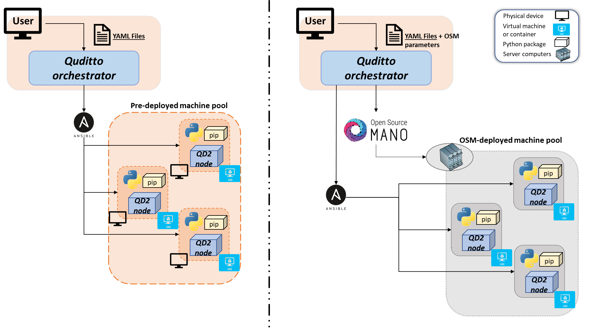

<picture>
  <source media="(prefers-color-scheme: dark)" srcset="Images/quditto_logo_dark.png">
  <source media="(prefers-color-scheme: light)" srcset="Images/quditto_logo_light.png">
  
</picture>

*Quditto* aims at providing researchers and industry stakeholders with an open-source software orchestrator capable of deploying digital twins of Quantum Key Distribution (QKD) networks.

QKD networks enable the secure dissemination of cryptographic keys to remote application entities following Quantum Mechanics principles. Still, quantum devices and equipment are still in a development phase, making their availability low and their price high, hindering the deployment of physical QKD networks and, therefore, the research and experimentation activities related to this field. *Quditto* enables the emulation of QKD network deployments, where experiments and trials can be performed without the quantum physical equipment requirement, nor compromising the integrity of an already built QKD network. 

Our digital twins implement each QKD node in software, allowing its execution in a physical or virtual machine, or in a virtualization container. We use the [*SimulaQron*](http://www.simulaqron.org) emulator to support quantum links between QKD nodes and qubit operations, such as creating and exchanging Bell pairs. Our QKD node design is aligned with the standardized ETSI APIs, currently supporting the [ETSI QKD 004 interface](https://portal.etsi.org/webapp/workprogram/Report_WorkItem.asp?WKI_ID=54395), and uses an implementation of the E91 QKD protocol to create keys between nodes. 

The configuration of the virtual QKD nodes is based on [Ansible](https://www.ansible.com), and [ETSI OSM](https://osm.etsi.org) can also be used. QKD nodes may be placed at different locations at the discretion of the user. To this purpose, our solution can leverage ETSI NFV-compliant cloud and edge infrastructures, (e.g., based on OpenStack), if available. Alternatively, it may set up the digital twin of the QKD network using physical or pre-provisioned virtual machines. After the deployment process, user applications can access the different QKD nodes to retrieve cryptographic key material using their respective ETSI standard interface.

For details on the design and implementation of the QKD digital twin orchestration service, please refer to this [article](https://www.mdpi.com/2076-3417/14/3/1018).

## Installation

The *Quditto* software is divided into three different components: the *quditto orchestrator*, the *quditto QKD node*, and the *quditto client*. To support the deployment of a digital twin of a QKD network, the *quditto orchestrator* needs to be installed. This can be done by downloading the [qd2_orchestrator](https://github.com/Networks-it-uc3m/Quditto/tree/main/qd2_orchestrator) folder, navigating to its directory, and then simply writing a pip install command:

```
pip install .
````

This will install all the required packages for the *quditto orchestrator*, and the *quditto orchestrator* itself.

To build applications on the QKD network digital twin environment, the *quditto client* package must be installed in the device that will act as a client application (that is, the application that will request cryptographic material from the QKD nodes). This can be done via pip:

```
pip install qd2_client
```

The *quditto QKD node* package will be automatically installed by the *quditto orchestrator* on the machines or virtualization containers that will act as QKD network nodes.

## Deploying a digital twin of a QKD network

*Quditto* allows both the use of pre-deployed resources such as physical machines, virtual machines, or virtualization containers, and the use of ETSI NFV-compliant cloud and edge infrastructures, (e.g., based on OpenStack), orchestrated by ETSI OSM. Both scenarios, presented in the figure, are discussed below. 





### Scenario 1: Pre-provisioned set of physical/virtual machines or virtualization containers

To deploy a digital twin of a QKD network on pre-provisioned physical or virtual machines, or virtualization containers, the orchestrator device is required to be able to make *ssh* connections with the machines or containers that will act as QKD nodes. These machines and containers need to count with Python 3.

The *quditto orchestrator* package has to be installed in the device that will serve as orchestrator. To start the QKD network digital twin deployment, two YAML files must be specified to the *quditto orchestrator*: the *config.yaml* file, which describes the desired topology for the QKD network; and the *inventory.yaml* file, providing the details that are necessary to configure each virtual machine and transform it into a functional QKD node in the digital twin. 

More concretely, the *config.yaml* file must contain:

- The service version (version 0.1.0 is, for now, the supported version).
- The API used by the QKD nodes (currently only the [ETSI GS QKD 004 V2.1.1](https://www.etsi.org/deliver/etsi_gs/QKD/001_099/004/02.01.01_60/gs_qkd004v020101p.pdf) is supported).
- The QKD protocol is used to form the keys (0.1.0 version implements the E91 protocol).
- The node names along with their IP addresses, and their neighbours.

The *inventory.yaml* file must contain:

- The IP address of each node.
- The SSH credentials for each machine or container.
- The directory where Python is installed.

A sample of these YAML files for an exemplifying QKD network can be found in the [functional test](https://github.com/Networks-it-uc3m/Quditto/tree/main/functional_test) folder. 

The *quditto orchestrator* must be executed providing both files as arguments: 

```
qd2_orchestrator start config.yaml inventory.yaml
```

This command will install the *quditto QKD node* software on each machine or container indicated in the documents, and start the emulation of the different channels, using *SimulaQron*, to connect the nodes as described in the YAML configuration file. 

From this point on, the digital twin of the QKD network is operational to run client applications, which may request cryptographic material from the QKD nodes using the requested ETSI API (ETSI QKD 004 API, in the current version).

### Scenario 2: Full deployment automation using ETSI Open Source MANO (OSM)

This method also uses as input a *config.yaml* file and an *inventory.yaml* file, to provide the *quditto orchestrator* with the topology of the desired QKD network. However, in this case, it is not necessary to include the IP addresses or the ssh credentials in either of the files, as the OSM software will automatically provide this information. Therefore, the IP address, the user, and the password fields in the documents can remain empty or with any value, since they will be ignored.

To deploy the QKD network without a pre-deployed machine pool, the [OSM client package](https://osm.etsi.org/gitlab/osm/osmclient) needs to be installed in the orchestrator device. Then, the *quditto orchestrator* can be executed using the command indicated below. As can be seen, this command includes three additional arguments: the *osm_hostname*, the *vim_account*, and the *ssh_key*. These parameters correspond respectively to the IP address of the OSM host that will handle the topology deployment, the Virtual Infrastructure Manager (VIM) account (e.g., OpenStack) configured in OSM  where the allocation of virtual resources to the virtual machines comprising the topology will be conducted, and a public cryptographic key that will be injected from OSM to those virtual machines. This later allows the orchestrator to access the deployed virtual machines through the SSH public-key authentication method (i.e., passwordless) to then perform the corresponding configuration operations. 

```
qd2_orchestrator start config.yaml inventory.yaml --osm_hostname "IP-address" --vim_account "VIM account" --ssh_key /path/to/public-key-document
```

This command will instantiate the virtual machines required to deploy a digital twin of the QKD network described in the configuration file, install the *quditto node* software in each node, and start the emulation of the different channels, using *SimulaQron*, to connect the nodes as described in the configuration file.

From this point on, the network is operational to run client applications written with the *quditto client* package.

