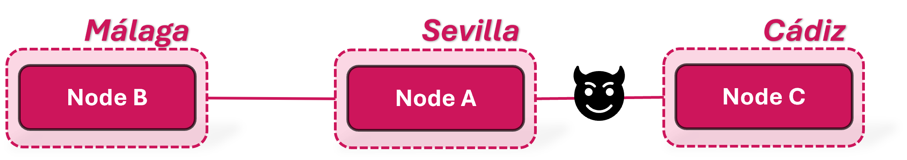

# Quditto Tutorial: Your First QKD Digital Twin Network

This tutorial is designed to help you create and test your first Quantum Key Distribution (QKD) digital twin network using Quditto and the *bb84_with_eve.py* script for the implementation of the BB84 protocol.

You will deploy a simple three-node topology **B–A–C**, with an **eavesdropper placed between A and C**. 




The tutorial walks you through several key exchange scenarios to explore both normal operation and compromised links.


##  Tutorial Setup Steps

1. **Select Devices**  
   Choose at least **three Python-capable devices** accessible via SSH and with pip to act as the distributed nodes.  
   >  *Note: The Quditto orchestrator and controller can run on any of the nodes—no dedicated machine is required.*

   In the provided YAML example, the controller runs on **node A**.

2. **Create the Configuration YAML**  
   We provide an example Configuration YAML. In it, the controller runs on **node A**.

   ```
   ---
   quditto_version: 2.0
   config:
     application_interface: etsi-gs-qkd-014
     qkd_protocol: bb84
     controller: A
     ip_controller: 10.4.48.59
     netsquid_user: your_user
     netsquid_pwd: your_pwd
   
   sites:
     - Sevilla
     - Malaga
     - Cadiz
   
   nodes:
     - node_name: A
       node_site: Sevilla
       node_ip: 10.4.48.59
       neighbour_nodes:
   
         - name: B
           link_length: 154
           protocol: bb84_att.py
           eavesdropper: False
   
         - name: C
           link_length: 100
           protocol: bb84_with_eve.py
           eavesdropper: True
           eavesdropper_parameters:
             eavesdropper_distance: 45
             percentage_intercepted_qubits: 10
   
     - node_name: B
       node_site: Malaga
       node_ip: 10.4.48.129
       neighbour_nodes:
   
         - name: A
           link_length: 154
           protocol: bb84_att.py
           eavesdropper: False
   
     - node_name: C
       node_site: Cadiz
       node_ip: 10.4.48.188
       neighbour_nodes:
   
       - name: A
         link_length: 100
         protocol: bb84_with_eve.py
         eavesdropper: True
         eavesdropper_parameters:
           eavesdropper_distance: 55
           percentage_intercepted_qubits: 10
   ```

   To create your own Configuration YAML you should:   
   - Update the **IP addresses** to match your device setup.  
   - Add your **NetSquid credentials** (username and password).
  
   You can also change the rest of parameters to modify however you want the link lengths, the distance from the nodes to the eavesdropper or the percentage of qubits that the eavesdropper intercepts. 

4. **Create the Inventory YAML**  
   We also provide an Inventory YAML example:
   ```
   ---
   all:
     hosts:
       A:
         ansible_host: 10.4.48.59
         ansible_connection: ssh
         ansible_user: ubuntu
         ansible_ssh_pass: ubuntu
         py_env: /home/ubuntu/.local/lib/python3.10
       B:
         ansible_host: 10.4.48.129
         ansible_connection: ssh
         ansible_user: ubuntu
         ansible_ssh_pass: ubuntu
         py_env: /home/ubuntu/.local/lib/python3.10
       C:
         ansible_host: 10.4.48.188
         ansible_connection: ssh
         ansible_user: ubuntu
         ansible_ssh_pass: ubuntu
         py_env: /home/ubuntu/.local/lib/python3.10
   ```

   You should adapt it to reflect your configuration by:
   - Updating the **IP addresses** again.  
   - Adding the **SSH credentials** and the path to the Python interpreter on each device.

6. **Deploy the Orchestrator**  
   - Choose a device connected to the network to act as the orchestrator (it can be one of the nodes) and run:  
     ```bash
     pip install qd2_orchestrator
     ```
   - From a terminal, go to the folder containing the tutorial YAML files and start the orchestrator:
     ```bash
     qd2_orchestrator start config.yaml inventory.yaml
     ```

Once these steps are completed, your QKD Network is configured and ready to receive key requests. 

##  Requesting and retrieving keys

### 1.  Key Exchange: Node A ↔ Node B

First, you will request **node A** for a 512 bit key shared with **node B**. To do so, run on any terminal with access to the nodes' network (that will act as the client terminal) the following command making sure you change the IP for your node A's IP:

```bash
     curl http://<NODE_A_IP>:8000/api/v1/keys/B/enc_keys?size=512
```

You should get as a response the key and its corresponding key ID. Using the key ID, you can retrieve the same key from **node B**:

```bash
     curl http://<NODE_B_IP>:8000/api/v1/keys/A/dec_keys?key_ID=<KEY_ID_AB>
```

You should again get as a response the key and the key ID. You can check that both keys match, meaning that the exchange was successful and **no eavesdropping** occurred.

You could also try retrieving a key from **B using a fake key ID**. This should fail, confirming the system validates key identifiers.


### 2.  Eavesdropped Exchange: Node A ↔ Node C

Now you will request **node C** for a key with **node A**. Keep in mind that according to the network you configured, there's an eavesdropper in this link. 

```bash
     curl http://<NODE_C_IP>:8000/api/v1/keys/A/enc_keys?size=512
```

Using the key ID from the response, you can retrieve the key from **A**.

```bash
     curl http://<NODE_A_IP>:8000/api/v1/keys/C/dec_keys?key_ID=<KEY_ID_CA>
```

This time, if you compare the two keys, you should see that they **do not match**, indicating the presence of an **eavesdropper** on the A–C link.


### 3.  Non-Neighbor Exchange: Node B ↔ Node C

Finally, you can try to initiate a key request between **nodes B and C**, that according to the network you configured are not neighbours:

```bash
     curl http://<NODE_B_IP>:8000/api/v1/keys/C/enc_keys?size=512
```

You should see that the system replies that **no such neighbor exists**, with a response like:

```bash
"{'message': 'Invalid partner requested.', 'details': 'The nodes are not neighbours'}"
```

>  *Note: This limitation can be addressed by implementing a Key Management Entity (KME) script that performs quantum key relaying via node A as a trusted node, but this is not directly supported by Quditto.*


##  Automatic test
If you want to automatically test the network you can run the test script on any terminal with access to the nodes' network with: 
     ```bash
     ./client.sh
     ```
This script performs all the requests and comprobations explained in the previous section.

